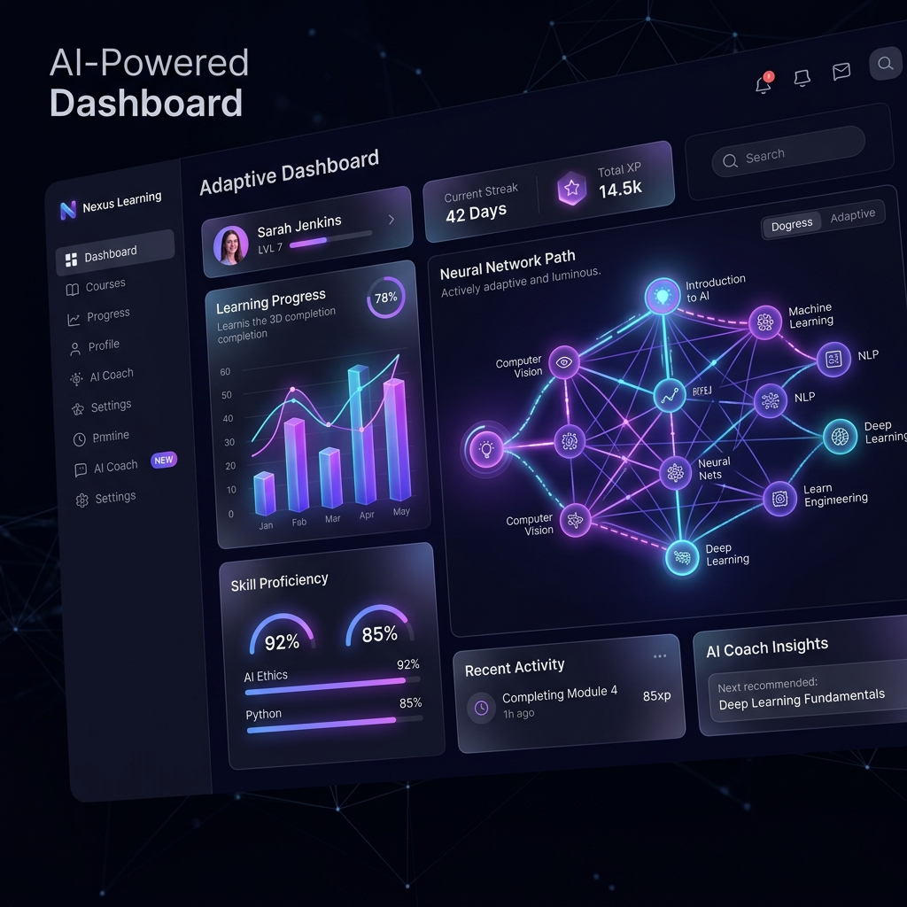
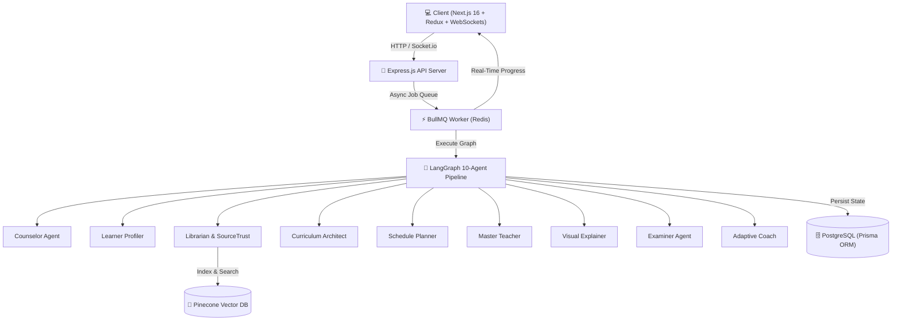

<div align="center">

# 🎓 AstraLearn AI — Autonomous Agentic Academy

### *An Intelligent, Self-Recalibrating Multi-Agent Learning Ecosystem*

[](https://nextjs.org/)
[](https://react.dev/)
[](https://www.typescriptlang.org/)
[](https://expressjs.com/)
[](https://langchain-ai.github.io/langgraph/)
[](https://www.prisma.io/)
[](https://redis.io/)
[](https://www.pinecone.io/)

---



</div>

---

## 🌟 Executive Summary

**AstraLearn AI** is an **autonomous, multi-agent educational ecosystem** designed to construct, deliver, evaluate, and continuously adapt personalized learning curricula in real time.

Operating on a **10-agent LangGraph state machine pipeline**, AstraLearn combines conversational diagnostic intake, Pinecone vector RAG indexing, multi-attribute source credibility verification (**SourceTrust**), interactive textbook lesson generation, dynamic Mermaid.js concept diagrams, automated MCQ evaluation, and adaptive path recalibration.

---

## 🤖 The 10 Autonomous AI Agents

| Agent ID | Agent Name | Role | Primary Responsibility |
| :---: | :--- | :--- | :--- |
| **01** | **Intake Counselor** | Diagnostic Interview | Conducts multi-turn conversational intake to extract student targets, timeline, and prior experience. |
| **02** | **Learner Profiler** | Cognitive Profiling | Synthesizes raw interview transcripts into structured learner profiles with baseline skill scores. |
| **03** | **Librarian Board** | Resource Discovery | Scours academic and web sources, generating embeddings for Pinecone vector storage. |
| **04** | **Source Verifier** | SourceTrust Verification | Evaluates external study materials using multi-attribute credibility scoring algorithms. |
| **05** | **Curriculum Architect** | Syllabus Generation | Generates multi-phase hierarchical syllabi tailored to student profiles and prerequisites. |
| **06** | **Schedule Planner** | Temporal Mapping | Maps syllabus modules onto daily calendar schedules based on user availability. |
| **07** | **Master Teacher** | Interactive Classroom | Writes step-by-step textbook lessons with interactive code snippets and key takeaways. |
| **08** | **Visual Explainer** | Blueprint Generator | Generates dynamic Mermaid.js architecture diagrams and visual mind maps. |
| **09** | **Examiner Agent** | Knowledge Verification | Generates targeted multiple-choice quizzes and grades student comprehension. |
| **10** | **Adaptive Coach** | Path Recalibration | Dynamically injects remedial lessons or fast-tracks advanced students based on evaluation scores. |

---

## 📚 Complete Documentation Catalog

The project maintains comprehensive documentation in the [`docs/`](file:///c:/Users/abhis/Desktop/autonomous-school/docs) directory:

### Core System Guides
- 📖 **[Application Features Guide](file:///c:/Users/abhis/Desktop/autonomous-school/docs/FEATURES.md)** — Comprehensive breakdown of all 9 workspace modules.
- 🏗️ **[System Implementation Architecture](file:///c:/Users/abhis/Desktop/autonomous-school/docs/IMPLEMENTATION.md)** — Node/Express, LangGraph state machine, BullMQ queues & WebSockets.
- 🌐 **[API & WebSocket Event Catalog](file:///c:/Users/abhis/Desktop/autonomous-school/docs/API_GUIDE.md)** — HTTP REST routes and Socket.io real-time event definitions.
- 🤖 **[10-Agent Technical Reference](file:///c:/Users/abhis/Desktop/autonomous-school/docs/agent_implementation.md)** — Schemas, tooling & state annotations for all 10 agents.
- 📋 **[Product Requirement Document (PRD)](file:///c:/Users/abhis/Desktop/autonomous-school/docs/prd.md)** — Core vision, personas, and system design specifications.
- 📐 **[Project Standards & Guidelines](file:///c:/Users/abhis/Desktop/autonomous-school/docs/project_standards.md)** — Monorepo structure, folder constraints, and coding rules.
- 🧪 **[Postman API Testing Guide](file:///c:/Users/abhis/Desktop/autonomous-school/docs/postman_testing_guide.md)** — Guide for executing tests via Postman collection.
- 🔀 **[Product Scope Router Plan](file:///c:/Users/abhis/Desktop/autonomous-school/docs/product-scope-router-implementation-plan.md)** — Scope routing and goal parsing specifications.
- 🎓 **[Teacher & Classroom Plan](file:///c:/Users/abhis/Desktop/autonomous-school/docs/teacher-implementation-plan.md)** — Interactive classroom and textbook generation plan.

### Individual Agent Specifications (`docs/agent-implementation/`)
- 💬 [01 - Intake Counselor Specification](file:///c:/Users/abhis/Desktop/autonomous-school/docs/agent-implementation/01-counselor.md)
- 👤 [02 - Learner Profiler Specification](file:///c:/Users/abhis/Desktop/autonomous-school/docs/agent-implementation/02-profiler.md)
- 🔍 [03 - Librarian Board Specification](file:///c:/Users/abhis/Desktop/autonomous-school/docs/agent-implementation/03-librarian.md)
- 🛡️ [04 - Source Verifier Specification](file:///c:/Users/abhis/Desktop/autonomous-school/docs/agent-implementation/04-source-verifier.md)
- 🗺️ [05 - Curriculum Architect Specification](file:///c:/Users/abhis/Desktop/autonomous-school/docs/agent-implementation/05-curriculum-architect.md)
- 📅 [06 - Schedule Planner Specification](file:///c:/Users/abhis/Desktop/autonomous-school/docs/agent-implementation/06-schedule-planner.md)
- 📖 [07 - Master Teacher Specification](file:///c:/Users/abhis/Desktop/autonomous-school/docs/agent-implementation/07-teacher.md)
- 📊 [08 - Visual Explainer Specification](file:///c:/Users/abhis/Desktop/autonomous-school/docs/agent-implementation/08-visual-explainer.md)
- 📝 [09 - Examiner Agent Specification](file:///c:/Users/abhis/Desktop/autonomous-school/docs/agent-implementation/09-examiner.md)
- ⚡ [10 - Adaptive Coach Specification](file:///c:/Users/abhis/Desktop/autonomous-school/docs/agent-implementation/10-adaptive-coach.md)

---

## 🏛️ System Architecture



---

## ⚡ Quickstart Guide

### 1. Clone & Install Dependencies
```bash
git clone https://github.com/Abhishek-Jaiswar/autonomous-agent-driven-academy.git
cd autonomous-school

# Install server dependencies
cd server && pnpm install

# Install client dependencies
cd ../client && pnpm install
```

### 2. Configure Environment Variables
Copy `.env.example` to `.env` in both `server/` and `client/`:

```bash
# In server/
cp .env.example .env

# In client/
cp .env.example .env.local
```

### 3. Initialize Database
```bash
cd server
pnpm prisma generate
pnpm prisma db push
```

### 4. Run Locally
Start backend server and frontend client:

```bash
# Terminal 1: Backend Server (Port 8000)
cd server
pnpm run dev

# Terminal 2: Frontend Client (Port 3000)
cd client
pnpm run dev
```

Open [http://localhost:3000](http://localhost:3000) in your browser to enter the academy!

---

## 🐳 Docker Deployment

To launch the full stack (Postgres + Redis + Express API + Next.js App) with Docker Compose:

```bash
docker-compose up --build -d
```

---

<div align="center">
Built with ❤️ by the AstraLearn AI Team.
</div>
